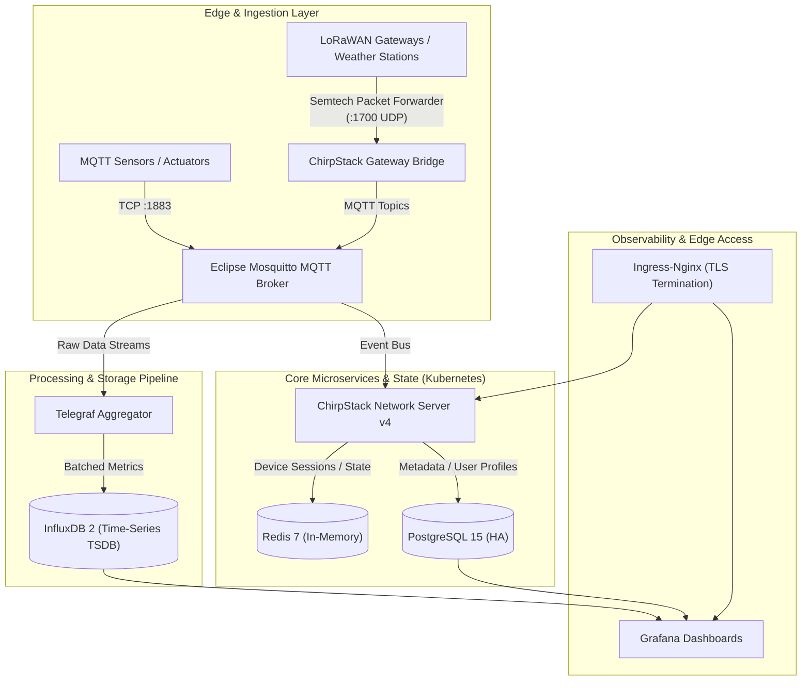

# Cloud-Native IoT Telemetry & Observability Platform (Helm / GitOps)


> [!IMPORTANT]
> **Confidentiality, Sanitization & NDA Notice:**  
> This repository represents a fully abstracted reference architecture synthesized from real-world telemetry infrastructure engineering. 
> All proprietary employer assets, company-specific network topologies, private hostnames, and credentials have been strictly purged. 
> The commit history has been intentionally wiped clean and initialized from scratch to guarantee zero secret retention and full NDA compliance.

---

## 1. Architectural Blueprint



---

## 2. Platform Capabilities

* **Declarative Helm Packaging:** All microservices (ChirpStack, Mosquitto, InfluxDB, Telegraf, PostgreSQL) packaged into modular Helm templates.
* **Zero-Trust Secret Management:** Completely decoupled from static configuration; integrates with HashiCorp Vault / ExternalSecrets Operator.
* **High-Throughput Telemetry Ingestion:** Multi-protocol support (MQTT, LoRaWAN Gateway Bridge, UDP telemetry).
* **Time-Series Persistence:** Dual-engine storage utilizing PostgreSQL for relational entities and InfluxDB for high-cadence sensor metrics.

---

## 3. Deployment Guide

### Prerequisites
* Kubernetes cluster `1.28+`
* Helm `v3.12+`
* Ingress controller (e.g. `ingress-nginx`)
* Storage provisioner (e.g. `local-path` or CSI driver)

### Quick Start
```bash
# 1. Create target namespace
kubectl create namespace telemetry-system

# 2. Populate environment secrets (from sanitized template)
kubectl apply -f charts/iot-telemetry-platform/secrets.example.yaml

# 3. Deploy the platform via Helm
helm upgrade --install telemetry-platform ./charts/iot-telemetry-platform \
  --namespace telemetry-system \
  --values ./charts/iot-telemetry-platform/values.yaml

# 4. Verify deployment health
kubectl get pods,svc -n telemetry-system
```

---

## 4. Repository Structure

```text
├── charts/
│   └── iot-telemetry-platform/
│       ├── Chart.yaml              # Helm chart metadata
│       ├── values.yaml             # Production parameter definitions
│       ├── secrets.example.yaml    # Safe secret template (no hardcoded passwords)
│       └── templates/
│           ├── _helpers.tpl        # Template labels and naming conventions
│           ├── chirpstack.yaml     # LoRaWAN server deployments & services
│           ├── mosquitto.yaml      # MQTT broker cluster service
│           ├── postgresql.yaml     # StatefulSet with persistent storage
│           ├── redis.yaml          # In-memory cache deployment
│           ├── influxdb.yaml       # Time-series database StatefulSet
│           └── ingress.yaml        # TLS-enabled Ingress definitions
└── README.md                       # Architecture specification & security audit
```

---

## 5. Security & Maintenance
Maintained by **Temirbek Rakhimgalyiev** ([LinkedIn](https://www.linkedin.com/in/temirbek-rakhimgalyiev-443174246/)).  
All manifests adhere to CIS Kubernetes benchmarks and non-root execution policies.
